# 📚 HonZuki: Your Personal Book Sanctuary

> A modern Progressive Web App (PWA) for managing your physical book collection with cloud sync, reading progress tracking, and beautiful adaptive themes.

---

## 🌐 Access the App

**Web App**: [https://hon-zuki.vercel.app](https://hon-zuki.vercel.app)

**Android App**: Download [HonZuki.apk](./HonZuki.apk) and install on your Android device

---

## 📖 About

HonZuki is a feature-rich book management application designed for book lovers who want to organize their physical book collection digitally. Track your reading progress, organize books into custom shelves, manage series, and sync everything across all your devices.

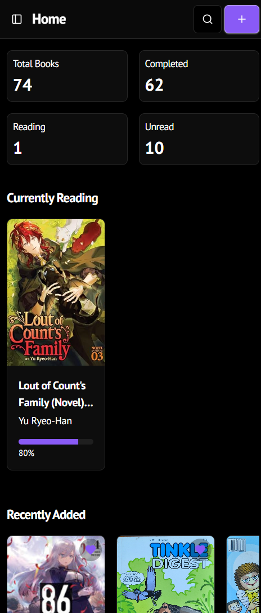

---

## ✨ Key Features

### 📚 Library & Series Management

* Track books with rich metadata (author, genre, format, language, ISBN)
* **Series as first-class entities**

  * Dedicated series pages
  * Progress tracking (owned vs read vs total)
  * Visual progress bars and completion percentage
  * Ongoing / Completed series status
* Create and edit series directly from book forms
* Smart series auto-complete and prompts
* Grid and list views for books

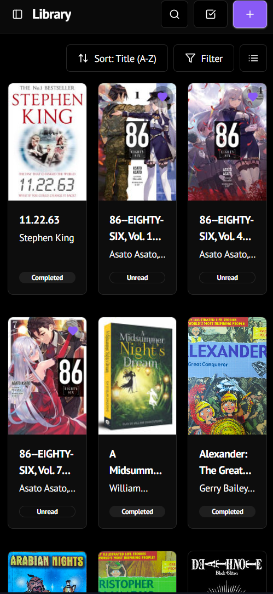

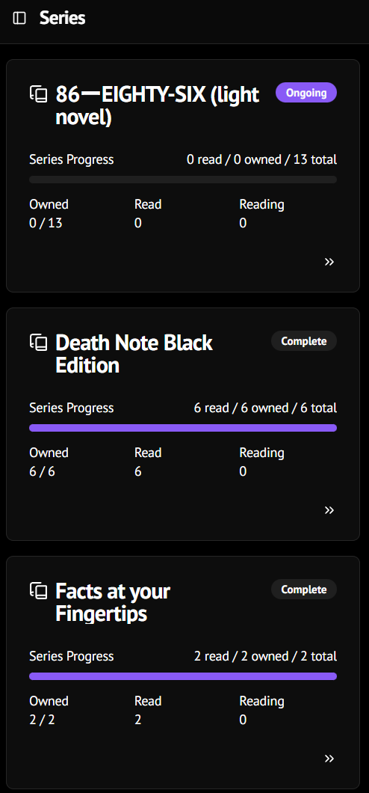

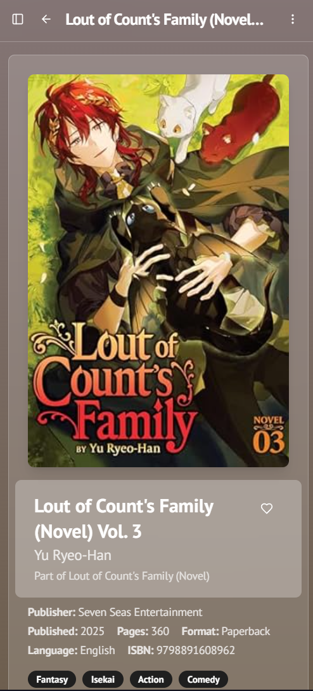

### 📊 Statistics & Insights

* Comprehensive stats dashboard

  * Total books, pages, authors, genres, series
  * Completion rate
* Genre distribution chart
* Books by reading status and format
* Year-based reading stats (lifetime + per year)
* Reading time estimates with configurable reading speed

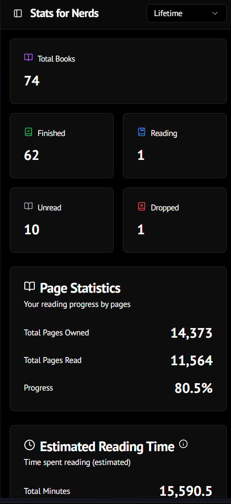

### 🔍 Discovery & Browsing

* Global real-time search with highlighting
* Advanced filtering

  * Reading status, genres, languages, publishers, shelves
* Advanced sorting

  * Author, progress, page count
* Browse by:

  * Authors
  * Genres
  * Series

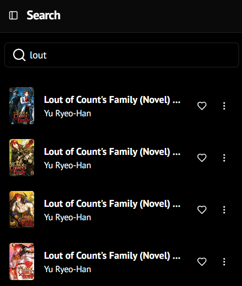

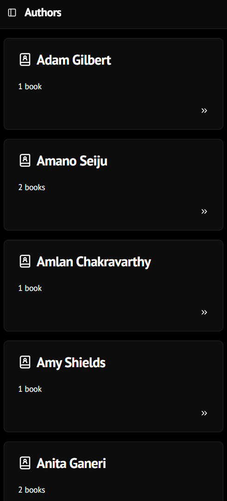

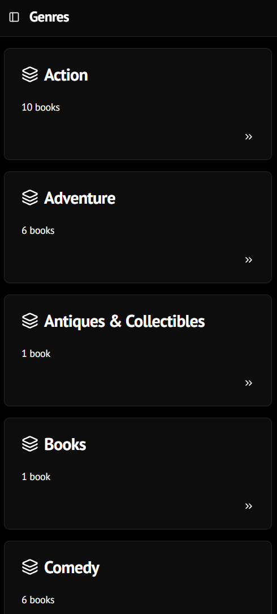

### 💖 Wishlist

* Separate wishlist with full metadata support
* One-tap move from wishlist to library
* Search and filter wishlist items

### 📖 Custom Shelves

* Create personalized shelves for better organization
* Organize books by themes, reading goals, or any custom category
* Easy shelf management and book assignment

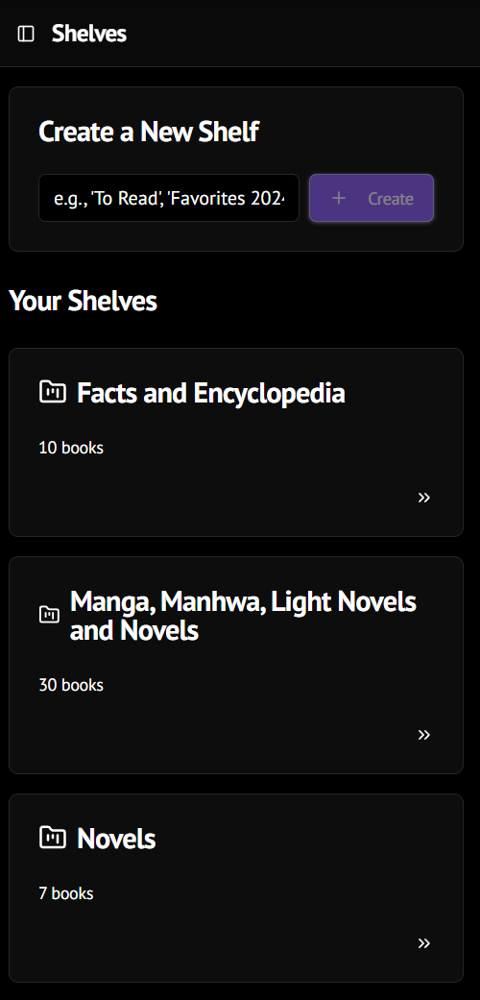

### 🎨 Customization

* Fully customizable themes

  * Solid and gradient accent colors
  * Gradient backgrounds
  * Theme import/export
* Adaptive book detail backgrounds based on cover colors
* Multiple font options

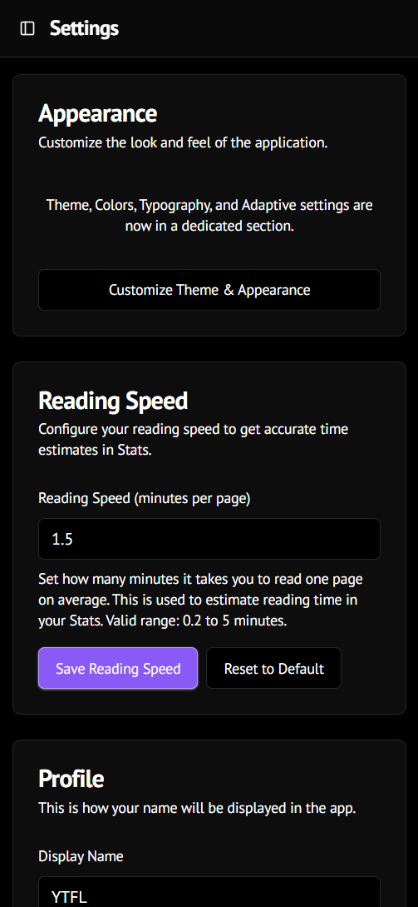

### 💾 Data Management

* Local-first storage (browser-based)
* Import/export data (CSV & JSON)
* Export library, wishlist, settings, and themes
* No cloud sync (yet)

### ➕ Adding Books

* Multiple ways to add books to your collection:
  * Search by title with automatic metadata fetching
  * Scan ISBN barcode (requires HTTPS)
  * Manual entry for complete control
* Rich metadata support

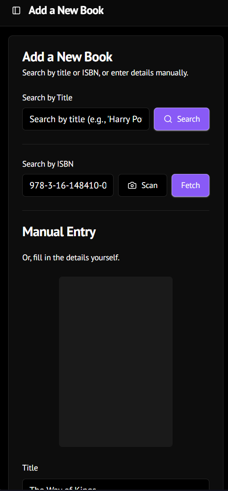

### 🔗 Sharing (Limited)

* Share your library, series, or custom collections
* Create public share links (when authentication is enabled)
* Currently limited due to authentication being disabled

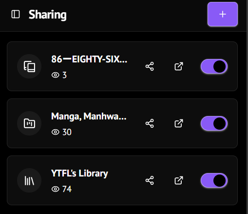

### 🔐 Accounts (Planned / Limited)

* Guest usage supported
* Authentication and cloud backup planned for future release

---
- ❌ **No login or registration** - Authentication features are disabled
- ❌ **No cloud storage** - Data is NOT saved to Firebase database
- ❌ **No cloud sync** - Your data won't sync across devices
- ❌ **Sharing features disabled** - Cannot create public share links
- ✅ **All core features work** - Add books, track reading, organize library
- ✅ **Data saved locally** - Securely stored in your browser's localStorage
- ✅ **Works offline** - Fully functional without internet

#### 💡 Current Workflow:
1. Use the app normally - all features work!
2. **Export your library regularly** (Settings → Export) as backup
3. Keep export files safe
4. When authentication is fixed, you can import your data

#### ⚠️ Important Warnings:
- **Clearing browser data = losing your library!** Export regularly!
- **Data is device-specific** - Won't transfer to other devices
- **Use same browser** - Data doesn't transfer between browsers on same device

**Status**: We're actively working on fixing authentication. Expected in v1.2.0 update.

### Other Known Limitations

- ISBN scanner requires HTTPS (camera access restriction)
- Barcode scanning may not work on all devices or browsers
- Some ISBN lookups may fail due to external data source availability
- Large libraries (1000+ books) may experience slower load times

---

## 🗺️ Roadmap

### 🔧 Coming Soon
- [ ] **Fix authentication system**
- [ ] Reading goals and challenges
- [ ] Book recommendations based on reading history
- [ ] Enhanced statistics and analytics
- [ ] Book reviews and ratings
- [ ] Reading notes and highlights

### 🔮 Future Features
- [ ] Social features (follow friends, share reviews)
- [ ] Book clubs and group reading
- [ ] Export to Goodreads/LibraryThing
- [ ] Bulk ISBN import
- [ ] Enhanced mobile app with React Native

---

## 🤝 Contributing

While the source code is not publicly available, you can contribute by:

- 🐛 Reporting bugs and issues
- 💡 Suggesting new features
- 📖 Improving documentation
- 🌍 Helping with translations
- ⭐ Starring the repository if you like the app

Open an issue on GitHub to get started!

---

## 📄 License

This application is provided as **freeware** for personal and non-commercial use.

**You may:**
- ✅ Use the app for free
- ✅ Share the APK file with others
- ✅ Install on multiple devices

**You may not:**
- ❌ Modify or reverse engineer the application
- ❌ Use for commercial purposes without permission
- ❌ Remove copyright notices

See the [LICENSE](LICENSE) file for complete terms and conditions.

**Note:** The source code is not included in this repository and remains proprietary.

---

## 👨‍💻 Author

**YTFL**
- GitHub: [@YTFL](https://github.com/YTFL)

---

## 💬 Support

Need help or have questions?

- 📫 Open an issue on GitHub
- 📚 Check the documentation in this README
- 🔍 Review closed issues for solutions

---

## 🙏 Acknowledgments

Built with amazing open-source technologies:
- [Next.js](https://nextjs.org/) - The React framework for production
- [Firebase](https://firebase.google.com/) - Backend infrastructure
- [shadcn/ui](https://ui.shadcn.com/) - Beautiful component library
- [Tailwind CSS](https://tailwindcss.com/) - Utility-first CSS framework
- [Lucide](https://lucide.dev/) - Beautiful icon library
- [Vercel](https://vercel.com/) - Deployment platform

---

## ⭐ Star History

If you find HonZuki useful, please consider giving it a star! ⭐

---

**Made with ❤️ for book lovers, by a book lover**

*Happy Reading!*
